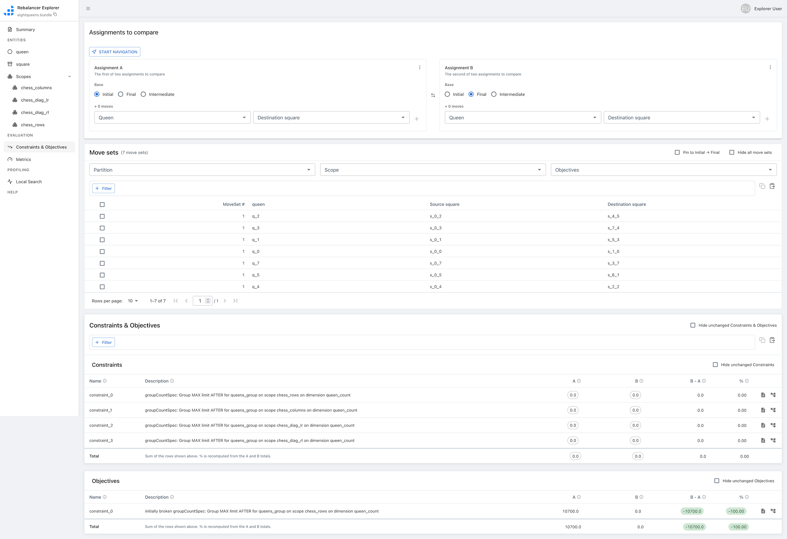

# Rebalancer


Rebalancer is an assignment solver library that provides a generic and intuitive API for defining any assignment problem and the ability to optimize the assignment given a variety of implemented algorithms.

An assignment problem is any problem that can be defined as a decision of how to assign objects to containers, such that each object is assigned to exactly one container, given that it satisfies a set of constraints/rules and optimizes a set of objectives/goals.

The core solver is written in C++ and runs in a single process with multi-threaded parallelism. Currently, it can handle problems with ~1M objects and containers reasonably well. It's easily extensible to support new solving algorithms and expressions. Independent of the problem definition the user can choose from multiple solving algorithms. The most common are:
* **Local search** starts with an arbitrary assignment, and keeps performing simple moves (such as moving an object to a different container, swapping two objects, etc.) that are valid and improve the objective, until it can't find new improvements (or hits a user-defined moves limit or time limit). This solver is not guaranteed to find a global optimal solution, but it scales very well and can handle big problems.
* **Optimal solver (mixed-integer programming)** represents the problem as a set of mixed-integer programming expressions, and solves it using a generic external library (Rebalancer currently supports two commercial solvers, [FICO Xpress](https://www.fico.com/en/products/fico-xpress-optimization) and [Gurobi](https://www.gurobi.com/) as well as the open source solver [HiGHS](https://highs.dev/)). These solvers will find optimal solutions given enough time, but they don't scale to handle huge problems well.

There is a finite (but easily extensible) set of predefined expressions that can be used to represent goals and constraints. A few examples of popular ones:
* **Balance**: make a given dimension balanced across containers. For example, say the objects are shards and containers are hosts, each shard has a given CPU utilization, and it is desired to distribute shards across hosts in a way that overall CPU utilization of all hosts is as similar as possible.
* **Capacity**: limit a dimension within containers. For example, say each shard (object) has a memory requirement (dimension), each host (container) has a memory capacity (dimension), and it is required that the sum of memory required by all shards in a host doesn't exceed the memory capacity of the host.

Users interact with Rebalancer via an interface which is available in C++ and Python.

## Quick Example

Four tasks, two hosts, one capacity constraint — `host0` starts overloaded with
three tasks and `host1` has one. Rebalancer finds a balanced 2-2 assignment using
local search or, optionally, a MIP solver backed by HiGHS, Gurobi, or FICO Xpress:

**Python**

```python
from rebalancer import ProblemSolver
from rebalancer.specs import (
    CapacitySpec, ConstraintSpec, LocalSearchSolverSpec,
    MoveTypeSpec, SingleMoveTypeSpec, SwapMoveTypeSpec, SolverSpec,
)

solver = ProblemSolver(service_name="rebalancer", service_scope="example")
(solver
    .set_object_name("task")
    .set_container_name("host")
    .set_assignment({"host0": ["task0", "task1", "task2"], "host1": ["task3"]})
    .add_object_dimension("memory", {"task0": 10, "task1": 10, "task2": 10, "task3": 10})
    .add_container_dimension("memory", {}, default_value=20.0)
    .add_constraint(ConstraintSpec(capacitySpec=CapacitySpec(
        name="memory_capacity", scope="host", dimension="memory")))
    .add_solver(SolverSpec(localSearchSolverSpec=LocalSearchSolverSpec(
        moveTypeList=[MoveTypeSpec(singleMoveTypeSpec=SingleMoveTypeSpec()),
                      MoveTypeSpec(swapMoveTypeSpec=SwapMoveTypeSpec())])))
)
solution = solver.solve()
print(solution["assignment"])
# → e.g. {'task0': 'host1', 'task1': 'host0', 'task2': 'host0', 'task3': 'host1'}
```

**C++**

```cpp
auto solver = ProblemSolverFactory::makeProblemSolver("rebalancer", "example");
solver->setObjectName("task");
solver->setContainerName("host");
solver->setAssignment({
    {"host0", {"task0", "task1", "task2"}},
    {"host1", {"task3"}},
});
solver->addObjectDimension("memory",
    {{"task0", 10}, {"task1", 10}, {"task2", 10}, {"task3", 10}});
solver->addContainerDimension("memory", {}, /*defaultValue=*/ 20.0);

CapacitySpec cap;
cap.name() = "memory_capacity"; cap.scope() = "host"; cap.dimension() = "memory";
solver->addConstraint(cap);

LocalSearchSolverSpec ls;
ls.moveTypeList() = {ProblemSolver::makeMoveTypeSpec(SingleMoveTypeSpec{}),
                     ProblemSolver::makeMoveTypeSpec(SwapMoveTypeSpec{})};
solver->addSolver(ls);

auto solution = solver->solve();
// solution.assignment() maps task → host
```

## Installation

### Build from Source

#### Ubuntu

```bash
# Prereqs
sudo apt install git pip python3-pex libfast-float-dev libgoogle-glog-dev clang-19 clang-tools-19 clang-format-19

# Build Thrift and Folly from source
git clone https://github.com/facebook/fbthrift.git
cd fbthrift/
./build/fbcode_builder/getdeps.py install-system-deps --recursive fbthrift
pip3 install pex --user
./build/fbcode_builder/getdeps.py --scratch-path ./installed --allow-system-packages build fbthrift
cd ..

# Clone
git clone https://github.com/facebook/rebalancer.git

# Configure and build
cd rebalancer/build
cmake -GNinja \
  -DCMAKE_COLOR_DIAGNOSTICS=ON \
  -DCMAKE_PREFIX_PATH="$HOME/fbthrift/installed/installed/folly/lib/cmake/folly;$HOME/fbthrift/installed/installed/fbthrift/lib/cmake/fbthrift;$HOME/fbthrift/installed/installed/fmt/lib/cmake/fmt" \
  -DCMAKE_MODULE_PATH="$HOME/fbthrift/build/fbcode_builder/CMake" \
  -DCMAKE_BUILD_TYPE=Debug ..
ninja
```

##### HiGHS (open source MIP solver)

Pick one of the following:

```bash
# Option 1: Install via conda
conda install conda-forge::highs

# Option 2: Install via pip
pip install highspy

# Option 3: Build from source
git clone https://github.com/ERGO-Code/HiGHS.git
cd HiGHS && mkdir build && cd build
cmake -GNinja .. && ninja
```

#### macOS

> **Prerequisite:** Install [Homebrew](https://brew.sh) if you don't have it.
> After installing, open a new terminal so the `brew` command is available
> (or run the `eval "$(/opt/homebrew/bin/brew shellenv)"` line the installer prints).

```bash
# Install dependencies
brew install cmake ninja boost fmt folly googletest fbthrift

# Clone
git clone https://github.com/facebook/rebalancer.git

# Configure and build
cd rebalancer/build
cmake -GNinja \
  -DCMAKE_COLOR_DIAGNOSTICS=ON \
  -DCMAKE_PREFIX_PATH="/opt/homebrew/lib/cmake/folly;/opt/homebrew/lib/cmake/fbthrift;/opt/homebrew/lib/cmake/fmt" \
  -DCMAKE_BUILD_TYPE=Debug ..
ninja
```

#### Fedora

```bash
sudo dnf install boost-devel.x86_64 fbthrift-devel.x86_64 glog-devel.x86_64 gtest-devel.x86_64 gmock-devel.x86_64 fmt-devel.x86_64
```

#### After Building

The default build produces the Rebalancer library. To build and run the bundled
examples, pass `-DTESTS=ON` to CMake and rebuild:

```bash
# From rebalancer/build/
cmake -GNinja -DTESTS=ON -DCMAKE_BUILD_TYPE=Debug ..
ninja TasksOnHosts.exe
./TasksOnHosts.exe
```

This runs the tasks-on-hosts example — distributing tasks across hosts by memory
capacity — and prints the resulting assignment to stdout.

More examples are in `algopt/rebalancer/examples/` (shard allocation, web
balancing, knapsack, and others). Each `.cpp` file in that tree is built as a
standalone executable when `-DTESTS=ON` is set.

For **Python usage**, the source build does not produce a Python package.
Use `pip install rebalancer` instead (see [PyPI](#pypi) below).

### Install a Prebuilt Package

#### PyPI

```bash
pip install rebalancer
```

Then try the Python snippet from the [Quick Example](#quick-example) above.

#### Debian / Ubuntu

```bash
# Primary (requires gh CLI — https://cli.github.com)
gh release download --repo facebook/rebalancer --pattern "*.deb"
sudo dpkg -i rebalancer_*.deb

# Fallback (curl)
curl -sL $(curl -s https://api.github.com/repos/facebook/rebalancer/releases/latest \
  | grep "browser_download_url.*amd64\.deb" | cut -d'"' -f4) -o rebalancer.deb
sudo dpkg -i rebalancer.deb
```

The package's postinstall script runs `ldconfig` automatically.

Compile and run the smoke test:

```bash
curl -LO https://raw.githubusercontent.com/facebook/rebalancer/main/tools/packages/test_solve.cpp
g++ -std=c++20 test_solve.cpp -I/usr/local/include -L/usr/local/lib -lrebalancer \
    -Wl,-rpath,/usr/local/lib -o test_solve && ./test_solve
# → PASS: 2-2 split achieved
```

#### Fedora / RHEL

```bash
gh release download --repo facebook/rebalancer --pattern "*.rpm"
sudo rpm -i rebalancer-*.rpm
```

Compile and run the smoke test:

```bash
curl -LO https://raw.githubusercontent.com/facebook/rebalancer/main/tools/packages/test_solve.cpp
g++ -std=c++20 test_solve.cpp -I/usr/local/include -L/usr/local/lib -lrebalancer \
    -Wl,-rpath,/usr/local/lib -o test_solve && ./test_solve
# → PASS: 2-2 split achieved
```

#### macOS Homebrew

> **Note:** A Homebrew tap is coming. Until then, install from the formula file
> directly — Homebrew will fetch the prebuilt bottle from GitHub Releases.

```bash
brew install https://raw.githubusercontent.com/facebook/rebalancer/main/Formula/rebalancer.rb
```

Compile and run the smoke test:

```bash
curl -LO https://raw.githubusercontent.com/facebook/rebalancer/main/tools/packages/test_solve.cpp
clang++ -std=c++20 test_solve.cpp \
    -I$(brew --prefix rebalancer)/include \
    -L$(brew --prefix rebalancer)/lib -lrebalancer \
    -Wl,-rpath,$(brew --prefix rebalancer)/lib \
    -o test_solve && ./test_solve
# → PASS: 2-2 split achieved
```

## Rebalancer Explorer

Rebalancer Explorer is a web UI for inspecting and analyzing solver runs. It lets
you browse a problem's objects, containers, constraints, and goals, and see how a
solution scores against them. This makes it a handy way to understand and debug
solver behavior.



Under the hood, the Explorer backend is a C++ Thrift service that serves run data
directly from the solver. A small JSON proxy sits in front of it and exposes that
Thrift API over plain HTTP (`POST /v2/<method>`); the web UI calls the proxy
rather than the Thrift service directly, so the frontend needs no Thrift
toolchain and runs anywhere Node runs.

### Run with Docker Compose

The quickest way to try it is the bundled `docker-compose.yml`, which builds and
wires up every piece — the C++ backend, the JSON proxy, and the Next.js app. From
the repository root:

```bash
docker compose up --build
```

Then open [http://localhost:3000](http://localhost:3000).

Compose also seeds a shared volume with example problem bundles, so you can load
one from the UI by name (e.g. the
[`sudoku.py`](algopt/rebalancer/examples/sudoku/sudoku.py) example as
`sudoku.bundle`, or the
[`EightQueens.cpp`](algopt/rebalancer/examples/eightqueens/EightQueens.cpp)
example as `eightqueens.bundle`) and explore a sample run without setting up your
own.

For running the app directly with Node (e.g. for frontend development), see
[`algopt/rebalancer/explorer/app/README.md`](algopt/rebalancer/explorer/app/README.md).

## Development Setup

### Pre-commit hooks

This project uses [pre-commit](https://pre-commit.com/) to run `clang-format` automatically before each commit.

```bash
pip install pre-commit
pre-commit install
```

To manually check all files:

```bash
pre-commit run --all-files
```

## Notes on Contributing

A complexity of contributing to rebalancer is that it must compile both on Meta's build infrastructure as well as in the open source world. This dual requirement has led to a somewhat strange CMake design where CMake searches the entire directory tree for files it can build and then classifies them as library files, tests, benchmarks, or other executables. Anything that isn't a test, benchmark, or executable is bundled into the Rebalancer library which is linked against the executables. This means that if you _add_ files to the project, you'll need to re-run CMake manually to ensure that it detects these files and bundles them.

## Document/website development

* Development
  * Enter the [website/](website/) directory.
  * Run `yarn` to install all the various things you'll want and need.
  * Run `npm build` to build the site.
  * Run `npm run start` to start a development server to preview the site.
* Deployment
  * If you push a branch or make a pull request containing changes to the [website/](website/) directory or [docs.yml](.github/workflows/docs.yml) that will launch a GitHub Action to rebuild the docs.
  * The deployment step will only step will only be run if the base branch is `main` or `docs`. This branches can only be committed to by members of the core development team.
* View the website at: https://facebook.github.io/rebalancer/


## License

Rebalancer is licensed under the Apache 2.0 License. A copy of the license
[can be found here.](LICENSE)
